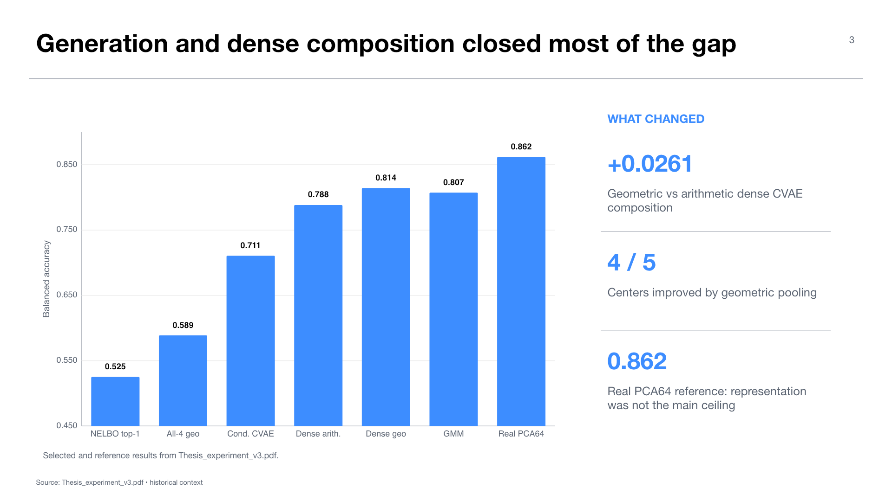

# Experiment 00 — BreakHis v3 bridge to the current MIDOG++ program

**Evidence role:** prior-meeting context, not part of the active MIDOG++ evidence chain  
**Source presentation:** `presentations/Thesis_experiment_v3.pdf`  
**Thesis objectives:** objectives 2–5, as an early demonstration of conditioned generation, expert selection, composition, and downstream evaluation

## Research question

The June presentation asked whether a target support set could identify a compatible independently trained CVAE expert and whether composition could reduce selection risk. The experiments used BreakHis with DINOv2 features and separated three possible bottlenecks: representation capacity, CVAE generation, and routing.

This dossier is retained because it defines the conceptual baseline for the current MIDOG++ work. Its numbers must not be pooled with the newer experiment: the dataset, backbone, domain definitions, feature dimensionality, support construction, and evaluation protocol changed.

## Design

The prior deck compared support-NELBO selection against random selection, larger top-k compositions, dense four-expert composition, and oracle references. It also compared an unconditioned CVAE, a class-conditioned CVAE, a diagnostic GMM, and a real-feature PCA64 reconstruction reference.

The analysis was structured as a bottleneck decomposition:

1. **Representation:** can a low-dimensional real reconstruction support high downstream utility?
2. **Generation:** how much performance is lost by the generative model and prior?
3. **Routing/composition:** can a support-derived score select the best expert, or does dense composition work better?

## Results

Support-NELBO top-1 reached BACC `0.5252`, only slightly above random top-1 at `0.5185`. Increasing the selected set improved performance: top-2 reached `0.5463`, top-3 `0.5758`, and all-four geometric composition `0.5887`. The single-expert oracle was `0.6769`, showing both selection error and limited expert quality.

Generation quality improved materially with class conditioning. The class-conditioned selected result reached `0.7107`, with an oracle of `0.7687`. The diagnostic GMM reached `0.8073` selected and `0.8442` oracle. Dense CVAE probability composition reached `0.7883` with arithmetic averaging and `0.8144` with geometric pooling; geometric pooling improved the average by `+0.0261` and improved four of five centers. The real PCA64 reconstruction reference was approximately `0.862`, so representation capacity was not the dominant loss.

## Interpretation

The main lesson was not that support-NELBO had solved routing. It was that sparse selection was fragile and dense composition reduced the cost of a poor ranking. Class conditioning and better latent distribution modeling were more consequential than further top-1 selection changes.

This directly motivates the current program:

- MIDOG++/Virchow2 strengthens the domain-shift benchmark and pathology representation.
- Stage 10 establishes a real-feature denominator rather than assuming the backbone is sufficient.
- Stage 20 separates posterior preservation from deployable prior sampling.
- Stage 30 freezes a larger independently trained expert bank.
- Stages 40–70 test dense equal union against metadata and learned routing under a staged, leakage-audited protocol.

## Claim boundary

The BreakHis result supports the historical qualitative hypothesis that dense composition is more robust than sparse proxy routing. It does not establish a MIDOG++ result, pathology-center generalization, formal privacy, or validation of the current router. Numeric comparisons across the two experimental generations are illustrative only.

## Supervisor takeaway

The current thesis did not abandon the June story; it rebuilt it more rigorously. The old result predicted the new one: representation and generation can be made useful, while reliable sparse routing remains the difficult part.

## Sources

- `presentations/Thesis_experiment_v3.pdf`, slides 4–14.
- `presentations/drafts/current_progress_synthesis_2026-08-22.md`, Sections 1 and 6.

