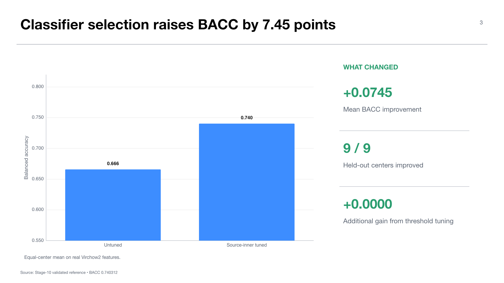

# Experiment 01 — MIDOG++ real-feature source-inner classifier reference

**Experiment:** `midogpp.real_feature.tuned_classifier.seed42` and matched v2 reference  
**Stage:** 10 — real-feature reference  
**Status:** validated; narrow `real_feature_transfer_only` evidence  
**Thesis objective:** objective 1, rigorous evaluation framework; prerequisite for objective 2

## Research question

Does source-inner classifier model selection improve cross-center transfer on real Virchow2 MIDOG++ features without using target labels for selection?

This experiment establishes the denominator against which CVAE preservation must be judged. Without it, a low synthetic result could be incorrectly attributed to the CVAE when the classifier or representation was already weak.

## Design and protocol

Nine eligible centers are evaluated in held-out-center folds: `0,1,2,3,5,6,7,8,9`; center `4` is quarantined. The held-out target center is excluded from classifier fitting and source-inner selection. Target labels are used only for final scoring.

The source-inner grid covers logistic-regression regularization `C in {0.01,0.1,1,10,100}`, L2 penalty, `lbfgs`, balanced or unweighted classes, and `max_iter` in `{2000,5000}`. The experiment also predeclares a one-standard-error threshold rule around `0.5`.

Protocol fields explicitly state that no generated embeddings, CVAE checkpoint, source-summary manifest, or router is used. The leakage/provenance inspection passes.

## Results

The tuned fixed-threshold classifier reaches mean BACC `0.740312` and macro-F1 `0.737205`; the untuned default reaches BACC `0.665812` and macro-F1 `0.661730`. The BACC gain is `+0.074500`, with wins in all nine centers. The largest center gain is `+0.117801` at center `3`; the smallest is `+0.032345` at center `1`.

The worst tuned center is center `1` at BACC `0.679245`; the best is center `6` at `0.792350`. The default model's worst center is center `2` at `0.594595` and its best is center `8` at `0.729338`.

The one-standard-error threshold selection chooses `0.5` in every fold. Consequently, fixed-0.5 and selected-threshold predictions are identical: classifier hyperparameter and class-weight selection drives the improvement, while threshold tuning contributes `0.000000` BACC.

## Interpretation

The experiment proves that the real Virchow2 surface carries meaningful transferable task signal and that source-inner classifier selection is consequential. It also supplies a fairer downstream denominator for the CVAE preservation experiment.

It does not show that a CVAE preserves the information, that a prior can generate useful embeddings, or that metadata/support scores identify a target-compatible expert. Those require separate stages.

## Limitations

- One classifier seed is evaluated.
- Probabilities are uncalibrated.
- No expert-ranking, oracle-gap, or routing metric is applicable.
- The result samples held-out centers from the known eligible-center set; it is not an external/new-center study.

## Claim boundary

The defensible claim is: source-inner model selection improves the real-feature source-only transfer reference from `0.6658` to `0.7403` BACC without target-label selection. Do not present this as CVAE utility, routing quality, or generative evidence.

## Supervisor takeaway

The foundation-model representation is not devoid of task signal. Later CVAE and routing failures must therefore be explained relative to a meaningful real-feature ceiling, not dismissed as a weak backbone.

## Sources

- `docs/wiki/03-experiments/midogpp-real-feature-source-inner-classifier-reference.md`.
- Canonical workstation artifact: `artifacts/midogpp/10_real_feature_reference/eligible_tuned_real_reference_v2/seed42/`.
- MIDOG++ dataset: Aubreville et al., 2023, *Scientific Data*.
- Virchow2: Zimmermann et al., 2024.

