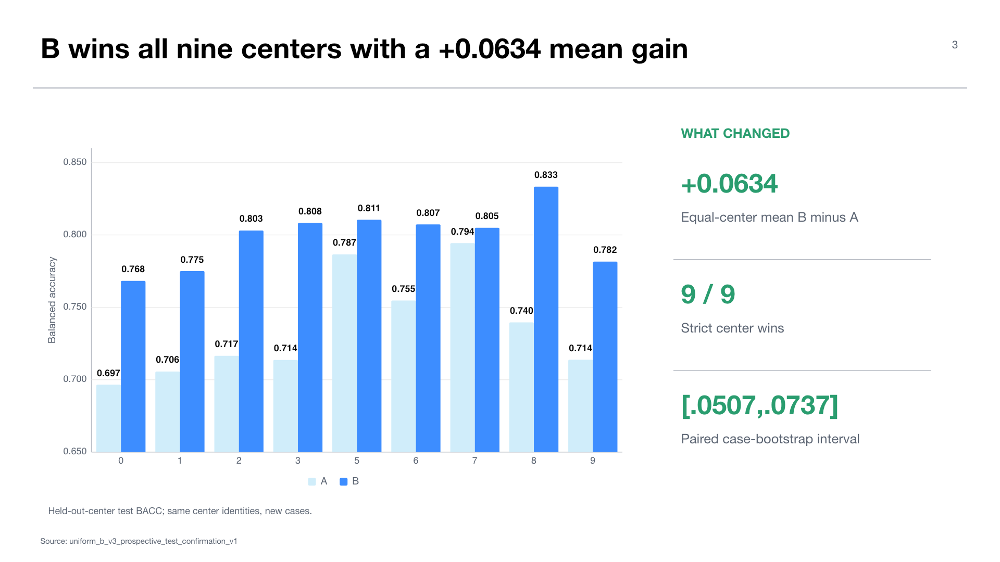

# Experiment 02 — Uniform-B prospective within-center representation confirmation

**Experiment:** `midogpp.oracle.uniform_b_v3_prospective_test_confirmation.v1`  
**Stage:** 90 — isolated representation diagnostic  
**Status:** `CONFIRMED_WITHIN_CENTER`; diagnostic-only for downstream-stage adoption  
**Thesis objectives:** objective 1 and the representation foundation for objective 2

## Research question

Does the frozen 3,840-dimensional canonical-JPEG fixed-center representation B outperform canonical representation A on new, case-disjoint test examples from the same nine observed centers?

Phase A had discovered B on train outer folds. Because that observation informed the hypothesis, Phase B froze the representation and gate before extracting B features or predictions on the test split.

## Design and protocol

The confirmation surface contains 9,928 eligible test rows. It has zero sample and case overlap with the 9,648 discovery rows; validation rows are unused. Both A and B classifiers are refit for each held-out center using the other eight centers and representation-specific classifier specifications frozen before test scoring.

The four predeclared gates require:

1. mean BACC improvement of at least `+0.02`;
2. at least six strict center wins;
3. worst-center delta at least `-0.01`;
4. a positive 95% conditional paired case-bootstrap lower bound.

No alternate representation, target-selected threshold, post-hoc gate, or validation-set choice is permitted.

## Results

Representation B reaches equal-center mean BACC `0.799159`, versus `0.735733` for A, for a gain of `+0.063426`. B wins all nine centers. Center-level gains range from `+0.010638` at center `7` to `+0.094679` at center `3`.

The 2,000-replicate paired case bootstrap has a mean delta of `+0.062661` and a 95% percentile interval of `[+0.050709, +0.073650]`. Every predeclared gate passes. The validator reconstructs 18 result rows, 19,856 predictions, nine paired comparisons, and the decision.

## Interpretation

The result removes a major ambiguity from the previous presentation: the pathology representation can be improved substantially and consistently on new cases. This strengthens the conclusion that the later routing bottleneck is not simply absence of signal in the feature extractor.

However, the confirmation remains within the same center identities. It estimates new-case performance under the observed center populations, not uncertainty over a new laboratory, scanner, institution, species, or external dataset.

## Relationship to the active pipeline

Because the experiment resides in Stage 90 and followed representation discovery, it may not silently revise the Stage-10 denominator or feed the Stage-20–70 chain. Adopting B as a new canonical foundation would require a separate protocol decision and fresh downstream lineage.

## Claim boundary

The defensible claim is: under the frozen classifier policy, representation B improves A for new cases within all nine observed MIDOG++ centers. It does not establish new-center generalization, CVAE preservation, synthetic utility, calibration, routing, or deployment.

## Supervisor takeaway

Representation choice matters, and B is convincingly better within the observed centers. Yet the current routing conclusion remains based on the separately frozen Uniform-B v2 lineage; the confirmation is explanatory, not a post-hoc license to rebuild the reported Stage-70 comparison.

## Sources

- `docs/wiki/03-experiments/midogpp-uniform-b-v3-prospective-test-confirmation-v1.md`.
- Canonical artifact: `artifacts/midogpp/90_oracles_and_diagnostics/uniform_b_v3_prospective_test_confirmation_v1/seed42/`.

