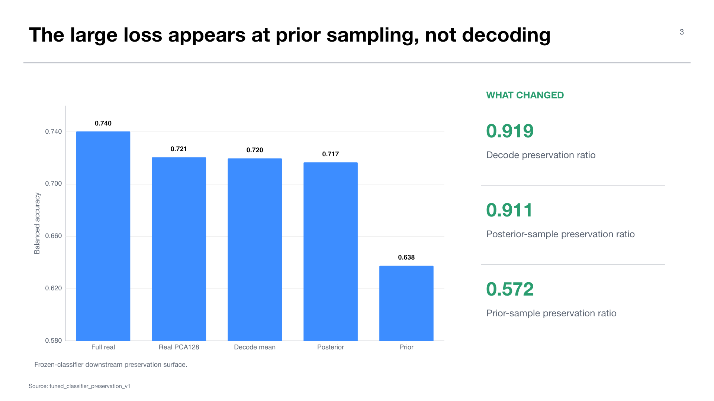

# Experiment 03 — CVAE tuned-classifier preservation

**Experiment:** `midogpp.cvae.tuned_classifier_preservation.v1`  
**Stage:** 20 — CVAE preservation  
**Status:** thesis-facing for the narrow `cvae_preservation_only` claim  
**Thesis objective:** objective 2, conditioned generative modeling of pathology foundation features

## Research question

When classifier specifications are frozen from the real Virchow2 reference, how much class-discriminative downstream signal survives through CVAE decode means, posterior samples, and prior samples?

The distinction between posterior-informed reconstruction and prior generation is central. A useful decoder can still fail as a deployable generator if the sampling prior does not cover the utility-bearing latent distribution.

## Design and protocol

The experiment imports the validated Stage-10 classifier specifications and evaluates four PCA128-aligned representations:

- real PCA128 reference;
- CVAE decoded posterior mean;
- CVAE posterior sample;
- CVAE standard-prior sample.

The imported reference must pass schema, leakage, and provenance checks. The new artifact keeps `claim_scope=cvae_preservation_only`; target labels are scoring-only and cannot select classifier specifications, thresholds, calibration, routing, or generation settings. Identity-overlap auditing covers sample ID, case ID, image path, and feature-row index across the nine eligible centers and reports zero overlap.

## Results

The full tuned real-feature reference is BACC `0.740312`. The dimension-matched real PCA128 surface reaches `0.720533`. CVAE decode means reach `0.719681` with preservation ratio `0.919368`; posterior samples reach `0.716630` with ratio `0.910740`. Both are close to the real PCA128 comparison.

Prior sampling falls to BACC `0.637563`, macro-F1 `0.630151`, and preservation ratio `0.571675`. Thus the pronounced utility loss appears when sampling without real-data posterior information, not in the deterministic decoder alone.

## Interpretation

This result sharpens the generative bottleneck diagnosed in the June deck. The CVAE architecture can reconstruct utility-bearing geometry, but the naive deployable prior is poorly matched to the latent distribution needed for downstream classification. That finding motivates the aggregate-posterior prior-recovery study and prevents an inefficient focus on decoder capacity alone.

Feature-space CVAE literature supports modeling foundation-model embedding distributions for synthetic-data sharing, but the intended downstream task must still be evaluated directly. Preservation ratios here are task-specific empirical evidence; they are not distributional-fidelity or privacy guarantees.

## Limitations

- The result is tied to the PCA128 comparison and frozen classifier surface.
- Preservation is not the same as held-out synthetic-training utility.
- The experiment does not test target-conditioned routing or expert selection.
- No differential-privacy training, accounting, or attack evaluation is included.

## Claim boundary

The defensible claim is that decode means and posterior samples preserve most of the dimension-matched classifier surface, while naive prior sampling is materially weaker. Do not promote this artifact into routing, expert-selection, metadata-compatibility, controllable-generation, or downstream synthetic-utility evidence.

## Supervisor takeaway

The CVAE decoder is not the main failure. The priority is to recover a useful deployable latent prior and then evaluate frozen expert compositions downstream.

## Sources

- `docs/wiki/03-experiments/midogpp-cvae-tuned-classifier-preservation.md`.
- Canonical artifact: `artifacts/midogpp/20_cvae_preservation/virchow2_cvae_midogpp_tuned_classifier_preservation_v1/seed42/`.
- Di Salvo et al., 2024, feature-space CVAE data sharing.

