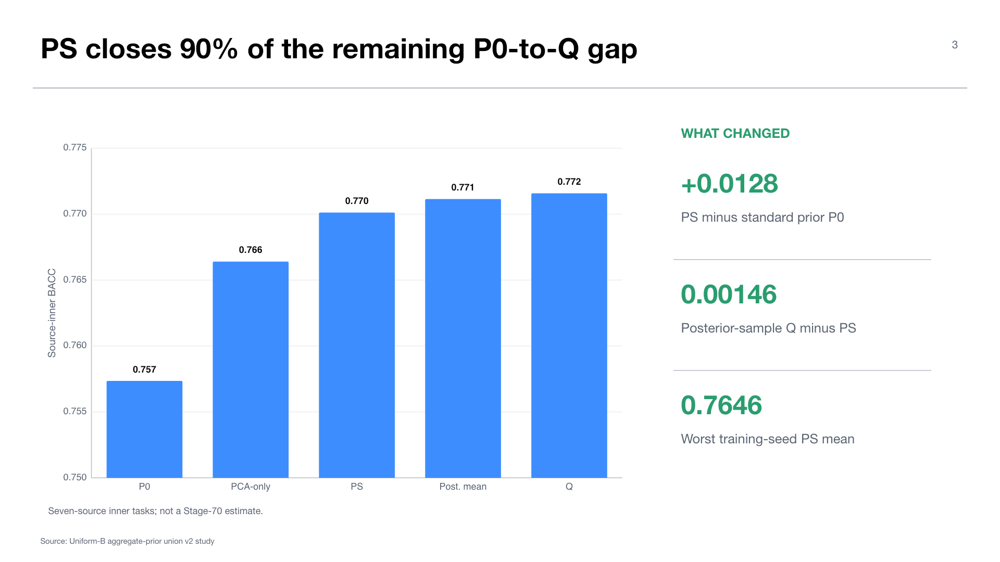

# Experiment 04 — Aggregate-posterior prior recovery

**Source study:** `midogpp.cvae.uniform_b_geco_aggregate_prior_union_source_inner.v2`  
**Stage:** 20 — source-inner prior mechanism study  
**Status:** completed and validated; consumed by separate Stage-30 promotion  
**Thesis objectives:** objective 2 and prerequisite for objective 4

## Research question

Can a source-only, class-conditional aggregate-posterior sampler recover the utility lost by standard-normal CVAE prior sampling without target data?

The preservation experiment showed that posterior-informed samples remain useful while naive prior samples degrade. This experiment tests the smallest mechanism change consistent with that diagnosis: replace the standard-normal prior `P0` with a source-only aggregate-posterior prior `PS` while preserving the independent-expert design.

## Design

The study is source-inner: each pseudo-target is excluded from the source pool used for the corresponding evaluation. It crosses training seeds `17,42,101` and generation seeds, compares a standard-normal prior, full-shrinkage aggregate-posterior sampling, posterior means, posterior samples, and a PCA-only reference, and records identity and convergence gates.

The source-inner nature matters. These results select a whole-bank recipe under nested source-only evidence; they do not estimate utility on the later held-out eight-source target composition.

## Results

The standard prior `P0` reaches mean BACC `0.757348`. Aggregate-posterior `PS` reaches `0.770112`, a gain of `+0.012764`. The posterior-sample ceiling `Q` is `0.771571`, leaving only `0.001459` between `PS` and `Q`. Posterior means reach `0.771145`; the PCA-only reference reaches `0.766401`.

The training-seed PS means are `0.772334`, `0.773440`, and `0.764562` for seeds `17`, `42`, and `101`. The minimum seed mean remains above the promotion threshold of `0.75`. No aggregate-prior fallback, identity-overlap failure, or classifier-convergence failure is recorded.

## Interpretation

This is the strongest positive mechanism result in the active CVAE chain. It shows that the latent prior mismatch diagnosed by preservation is largely recoverable with a source-only aggregate posterior. The remaining gap to posterior sampling is small relative to the original P0 loss.

The result justifies building the expert bank with PS, but it does not say which expert should be used for a target. Generation improvement and routing success are separate hypotheses.

## Relationship to the previous presentation

The June deck showed that class conditioning and a diagnostic GMM could recover much of the generative gap. PS provides the current lineage's analogous but more protocol-compatible mechanism: it improves prior sampling inside independently trained CVAEs without replacing them by a target-fitted density model.

## Claim boundary

The defensible claim is that aggregate-posterior sampling improves source-inner downstream utility and nearly reaches the posterior-sample ceiling. The value `0.770112` must not be quoted as expected Stage-70 target performance: those tasks used seven source centers, whereas the frozen target fold uses eight.

## Supervisor takeaway

The generator problem is no longer simply “the prior fails.” A source-only aggregate prior makes the expert bank viable; the unresolved question moves downstream to safe selection and composition.

## Sources

- `docs/context/current_experimental_state.md`, Uniform-B v2 source study.
- `docs/wiki/03-experiments/midogpp-uniform-b-v2-routing-authorized-expert-bank-v1.md`.
- Canonical source artifact: `artifacts/midogpp/20_cvae_preservation/uniform_b_geco_aggregate_prior_union_source_inner_v2/`.

