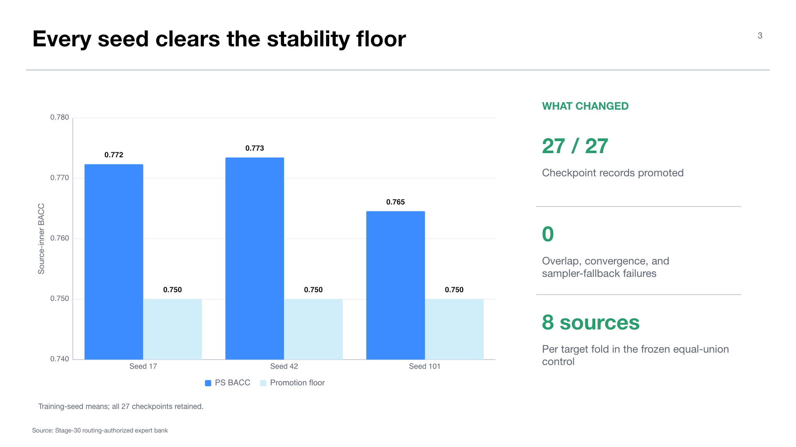

# Experiment 05 — Uniform-B v2 routing-authorized expert bank

**Experiment:** `midogpp.expert_bank.uniform_b_v2_routing_promotion.v1`  
**Stage:** 30 — expert-bank promotion  
**Status:** `PROMOTED_AS_ROUTING_AUTHORIZED_EXPERT_BANK`; validation `PASS`  
**Thesis objective:** objective 4, independently trained CVAE expert construction

## Research question

Does the aggregate-prior source study support promotion of a complete, independently trained expert bank into the routing lineage without selecting individual experts or seeds by held-out target performance?

## Design and promotion firewall

The bank crosses nine eligible source centers with three training seeds (`17,42,101`) for 27 checkpoints. Each checkpoint keeps its source-local decoding frame and source-only class-conditional full-shrinkage aggregate-prior state.

Promotion is a separate experiment rather than a lifecycle label attached to the Stage-20 source study. It revalidates checkpoint hashes, frames, sampler states, source-row identities, input hashes, convergence, and overlap. No held-out target metric selects an expert, center, or seed.

The routing candidates are nine source-center experts. Training seeds remain aligned replications; they are not 27 independently selectable actions.

## Results

All predeclared promotion gates pass. PS mean BACC is `0.770112` against a `0.70` floor. The worst training-seed mean is `0.764562` against `0.75`. `PS-P0=+0.012764` exceeds `+0.005`; `Q-PS=0.001459` remains below `0.01`. All 27 checkpoint records are present, with zero identity-overlap failures, convergence failures, or aggregate-prior fallbacks.

The publication state becomes `ROUTING_AUTHORIZED`. Key immutable identities include bank lock `9972a41dcd4814cd`, equal-union control lock `cddbcc3b3343fe38`, and promotion protocol hash `5b3087f3aa41c388`.

## Frozen control implied by the bank

For each held-out target `H`, the canonical equal-union control excludes expert `H`, uses all eight other sources, and generates 1,024 samples per class as 128 per source. Training and generation seeds are crossed and reported without seed selection. Target-conditioned source weights are forbidden.

## Interpretation

This experiment operationally achieves the independent-expert component of the MoErging objective. It establishes that all experts can be loaded, traced, and generated from under a common contract.

It does not establish routing. Bank quality and router quality are independent: a valid bank supplies the action space, but a separate target-excluded policy must decide whether any sparse action is preferable to equal union.

## Reproducibility caveat

The contents are hash-locked, but provenance records `repository_dirty=true` at revision `40221038...`. This does not invalidate the validated bytes, but a clean reconstruction is preferable for final thesis archival.

## Claim boundary

The defensible claim is `expert_bank_construction_only`. The bank may feed later routing experiments. Stage-20 evaluation labels have been consumed for whole-bank adoption and cannot be reused to choose an expert, seed, router feature, or policy.

## Supervisor takeaway

The thesis has built the intended independent-expert system. The remaining scientific burden is not engineering the bank; it is demonstrating that pre-evaluation information can improve on its strong dense fallback.

## Sources

- `docs/wiki/03-experiments/midogpp-uniform-b-v2-routing-authorized-expert-bank-v1.md`.
- Canonical artifact: `artifacts/midogpp/30_expert_bank/uniform_b_v2_routing_authorized_expert_bank_v1/`.

