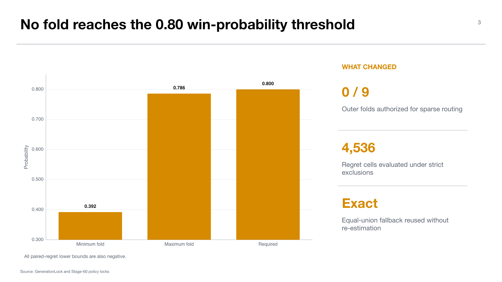

# Experiment 06 — GenerationLock and frozen routing policies

**Stages:** 40 and 60  
**Status:** generation and policy contracts complete; validators `PASS`  
**Thesis objectives:** objective 3, metadata routing design; objective 4, MoErging composition contract

## Research question

Can the expert bank be converted into reproducible, target-excluded generation and routing policies before any target-evaluation labels are opened?

This dossier combines the Stage-40 readiness experiment with the three Stage-60 policy locks because their scientific output is a sealed comparison contract, not a downstream score.

## Stage-40 GenerationLock

GenerationLock freezes source-only prior, decoding frame, sample budget, training and generation seeds, shuffle namespace, and classifier settings. It contains 81 source streams, 81 target-replicate contracts, and 162 passing health records under lock `34e551425710362e`.

These checks establish that the physical generation surface is complete and reproducible. They do not establish target utility.

## Stage-60 policies

Three policies are frozen:

1. **Equal union:** all eight non-target sources, 128 samples per source and class, 1,024 per class in total. It contains 81 replicates and 648 assignments under lock `4b9ea514308b084f`.
2. **Metadata max-tie union:** exact matches on tumor type, laboratory/origin, and scanner. All maximum-score ties are retained. The compatibility surface contains 72 target-excluded scores; the policy contains nine selections, 81 replicates, and 153 assignments under lock `27f16953b32c46cd`.
3. **Utility/regret policy:** 81 source-only synthetic classifiers generate 648 `q != e` utility rows and 3,168 case-confusion rows before policy fitting. The consumer forms 4,536 regret cells and 72 candidate summaries.

## Utility-gate result

All nine outer folds fail the predeclared single-source authorization gate. Best-source win probabilities range from `0.392` to `0.786`, below the required `0.80`, and every paired-regret 2.5% lower bound is negative. The policy therefore freezes the exact equal-union fallback in all nine folds; no assignments, streams, budgets, ordering, or shuffles are re-estimated.

## Interpretation

This is a successful fail-closed policy experiment. The result is not “the run failed”; it is “the permitted source-inner evidence was insufficient to justify sparse routing.” That distinction is important for the thesis: uncertainty control prevents an unstable learned rule from replacing a strong dense baseline.

The metadata policy is deliberately simple and label-free. It tests whether semantic domain similarity alone is sufficient. Stage 70 provides the first downstream answer.

## Claim boundary

Stages 40 and 60 support generation readiness and frozen-policy claims only. They compute no target BACC, macro-F1, routing gain, or deployable utility. The per-query best source inside utility training is a regret reference, not an outer-target oracle.

## Supervisor takeaway

Before evaluation, the thesis had three auditable, budget-matched arms. The learned utility router already signaled low confidence and defaulted to dense composition; the next question was whether metadata could nevertheless beat that fallback.

## Sources

- `docs/context/current_experimental_state.md`, Uniform-B v2 Generation and Stage-60 Policy Locks.
- `docs/wiki/03-experiments/midogpp-uniform-b-v2-source-inner-utility-regret-policy-v1.md`.
- Canonical roots: `artifacts/midogpp/40_prior_and_generation/uniform_b_v2_generation_lock/v1/` and `artifacts/midogpp/60_routing_and_composition/`.

