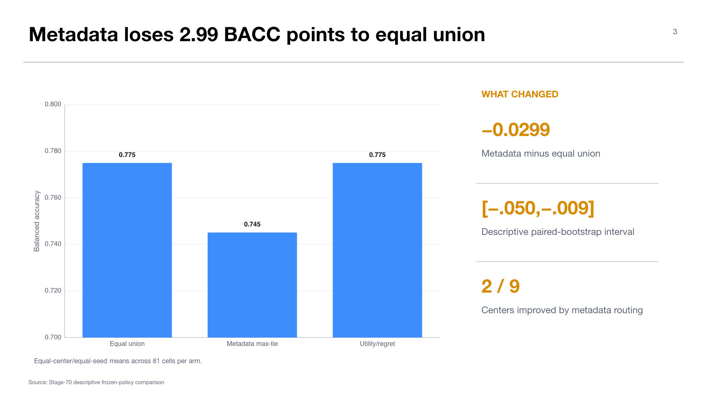

# Experiment 07 — Stage-70 frozen-policy downstream comparison

**Experiment:** `uniform_b_v2_descriptive_frozen_policy_comparison/v1`  
**Stage:** 70 — frozen-policy downstream evaluation  
**Status:** `DESCRIPTIVE_COMPARISON_COMPLETE`; validation `PASS`  
**Thesis objectives:** objectives 3–5, direct routing/composition evaluation

## Research question

Under matched candidate eligibility, generation budgets, seeds, shuffles, classifier settings, and evaluation rows, do frozen metadata or utility/regret policies outperform the dense equal-union CVAE composition?

## Design and evidence boundary

The run evaluates three already-frozen Stage-60 policies. It seals 243 prediction cells before target labels open. Target labels are used for scoring only; no policy or seed selection is performed. The artifact was produced from clean repository revision `380a0a99...` and validates independently.

The evaluation surface had previously been consumed. Therefore the comparison is deliberately labeled descriptive, with `fresh_confirmatory_status=BLOCKED_NO_UNCONSUMED_ELIGIBLE_SPLIT`. The resampling interval characterizes this frozen comparison but is not promoted to fresh confirmatory inference.

## Results

Equal union reaches mean BACC `0.774968` and macro-F1 `0.772608`. Metadata max-tie reaches BACC `0.745099` and macro-F1 `0.739957`. Its BACC difference from equal union is `-0.029868`, with descriptive paired bootstrap interval `[-0.050406,-0.008705]` across 2,000 valid resamples.

The utility/regret arm is bitwise-equivalent in predictions and performance to equal union: BACC `0.774968`, macro-F1 `0.772608`, and delta `0`. This is the expected consequence of all nine Stage-60 gates abstaining to the exact fallback.

Averaged over seed cells, metadata improves centers `2` (`+0.012011`) and `3` (`+0.022605`) but harms the other seven. The largest losses occur in centers `0`, `5`, `9`, `8`, and `1`. Domain metadata can therefore identify useful similarities locally while remaining unreliable as a global downstream-utility rule.

## Interpretation

This is the decisive downstream result of the active pipeline. The bank can generate a strong dense CVAE ensemble, but simple semantic matching does not improve it. The learned policy's abstention is scientifically coherent: its source-inner uncertainty gate prevented a harmful or unsupported sparse decision.

The result reproduces the qualitative lesson from the BreakHis deck under a stronger benchmark: dense composition is robust, while sparse proxy selection is brittle.

## Thesis consequence

Objective 4 is operationally achieved: the independent experts can be composed without retraining. Objective 3 is implemented but yields a negative result. Objective 5 has a complete descriptive comparison, but fresh/new-center confirmation remains open.

## Claim boundary

The thesis can claim a completed, protocol-clean descriptive negative routing result. It cannot claim fresh routing superiority, deployment readiness, external/new-center generalization, or significance on an unconsumed surface.

## Supervisor takeaway

Equal union is the current safe policy. A final routing experiment is justified only if it uses a genuinely fresh reservation and a single predeclared hypothesis; further optimization on this consumed test set can diagnose mechanisms but cannot create confirmatory evidence.

## Sources

- Workstation artifact: `/home/stud/spark/cvae_experiments/artifacts/midogpp/70_frozen_policy_downstream/uniform_b_v2_descriptive_frozen_policy_comparison/v1/`.
- `tables/arm_summaries.csv`, `tables/bootstrap_summary.csv`, `tables/target_metrics.csv`, and `reports/publication_decision.json`.

