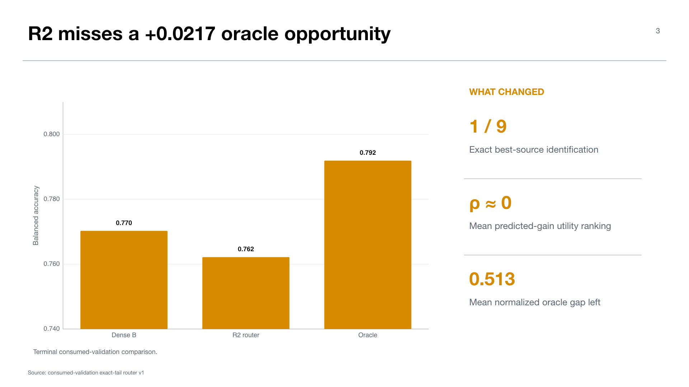

# Experiment 08 — Utility-aligned exact-tail router diagnostic

**Experiment:** `midogpp.oracle.uniform_b_v2_consumed_validation_utility_aligned_exact_tail_router.v1`  
**Stage:** 90 — terminal consumed-validation diagnostic  
**Status:** completed and validated; `consumed_data_diagnostic_only=true`  
**Thesis objective:** diagnostic support for objectives 3 and 5

## Research question

If the response model is aligned directly to the deployed source-tail action, can support-derived features rank action utility well enough to improve a dense base portfolio?

This experiment was designed to distinguish “no useful candidate actions exist” from “useful actions exist but the router cannot identify them.”

## Design

The router constructs exact-tail development utility under strict held-out-target `H`, pseudoquery `q`, and candidate-source `e` exclusions. All source caches, features, action bindings, target predictions, and global prediction seals are completed before terminal scoring.

`R2` is permanently marked insufficient for policy because it observes only two fixed unlabeled support cases. The experiment is therefore a terminal mechanism diagnostic, not a deployable Stage-60 policy.

The inference unit is the target center; technical seed cells are not treated as independent observations.

## Results

Dense base `B` reaches equal-center BACC `0.770276`. Routed `R2` reaches `0.762182`, for `R2-B=-0.008093` with 95% center-level interval `[-0.034655,+0.018468]`.

The terminal single-source oracle reaches `0.791928`, leaving `+0.021652` BACC headroom above B. However, `R2` identifies the exact best source only once in nine centers and agrees with an oracle tie three times. Mean normalized oracle gap is `0.513228`.

Predicted-gain utility Spearman varies sharply by center: positive at centers `1,2,3,8`, negative at `0,5,6,7,9`, and its equal-center mean is approximately zero (`-0.000860`). The oracle gap is fully missed at centers `5`, `6`, and `9`.

Secondary contrasts against `G_delta`, `U`, and permutation `P` have intervals spanning zero. No route comparison supports superiority.

## Interpretation

The experiment provides a clean localization: action-level headroom exists, but the support-derived proxy does not rank realized utility consistently. Improving the action library alone is insufficient; a router needs target-local information that transports across centers without opening evaluation labels.

The two-case support limit also explains why this result cannot authorize a policy. It is useful for mechanism diagnosis, not for a deployment decision.

## Claim boundary

The defensible claim is that the current proxy leaves measurable oracle headroom and has weak/unstable action ranking. Do not report the oracle as attainable performance, treat the interval as fresh confirmation, or feed any result into Stage 60/70 selection.

## Supervisor takeaway

The routing problem is identifiable: there are sometimes better source actions, but the present support signal cannot find them reliably. A final fresh study must test a predeclared ranking mechanism, not merely expand the action menu.

## Sources

- Workstation artifact: `artifacts/midogpp/90_oracles_and_diagnostics/uniform_b_v2_consumed_validation_utility_aligned_exact_tail_router/v1/`.
- `reports/scoring_summary.json`, `tables/contrast_inference.csv`, and `tables/oracle_hxe_diagnostics.csv`.

