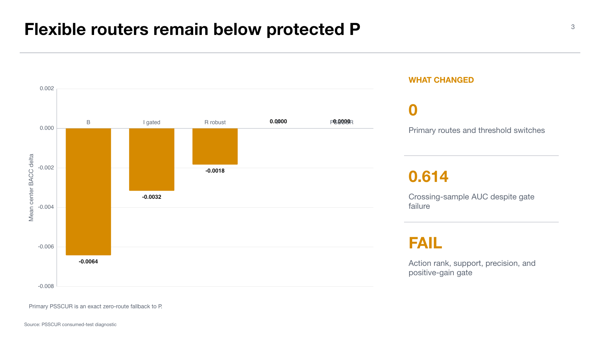

# Experiment 09 — PSSCUR simultaneous-shift calibrated utility router

**Experiment:** fixed-bank P-anchored simultaneous-shift calibrated utility router  
**Stage:** 90 — post-hoc consumed-test sensitivity  
**Status:** complete; information gate `FAIL`; `TERMINAL_DIAGNOSTIC_ONLY_DO_NOT_PROMOTE`  
**Thesis objective:** bottleneck diagnosis for metadata/utility routing

## Research question

Can target-local posterior utility predictions be converted into safe action changes by calibrating a simultaneous uncertainty envelope around a protected portfolio `P`?

The method separates a flexible candidate router from an authorization layer. An action is taken only if predicted BACC improvement survives the calibrated envelope and proper-loss safety conditions.

## Design

The experiment recomputes its own fixed-bank probability surface and respects the consumed-test ledger. Evaluation labels are terminal only. The primary method is `PSSCUR_ROBUST_ENVELOPE`; protected `P` is the exact fallback.

The information gate asks whether crossing-sample discrimination, action ranking, route support, route precision, proper-loss safety, and positive primary BACC gain jointly support interpreting the router. Row-level diagnostic samples are explicitly not independent inference units.

## Results

Protected `P` reaches equal-center BACC `0.807317`. The primary robust envelope authorizes zero routes, zero threshold switches, and exactly reproduces P in BACC, Brier score, and log loss.

Unprotected or opportunity-gated alternatives are worse than P on average. `B` reaches `0.800896` (`-0.006421`), `I_OPPORTUNITY_GATED` reaches `0.804161` (`-0.003156`), and `R_NINE_ARM_ROBUST` reaches `0.805486` (`-0.001831`). The flexible routers make many more harmful than helpful threshold switches in several arms.

The crossing-sample signal is nontrivial: equal-center AUC is `0.613669`, compared with blocked-control AUC `0.511099`. Yet action ranking, route support, route precision, and positive-gain checks fail. No primary envelope is nonvacuous in any center. The diagnosed bottleneck is `POSTERIOR_UTILITY_DOES_NOT_RANK_REALIZED_ACTIONS`.

## Interpretation

The experiment shows why a seemingly informative local signal does not automatically yield safe routing. A proxy can discriminate some descriptor events while failing the signed downstream-utility ranking needed to choose an action. The conservative envelope correctly refuses to convert this signal into routes.

Zero routing is therefore both a negative scientific result and a safety result: the method preserves the protected fallback rather than claiming benefit from unstable action estimates.

## Claim boundary

This is post-hoc consumed-test sensitivity. `PSSCUR_ROBUST_ENVELOPE=P` is not evidence of equivalence, deployment safety, or routing success. The information gate failure cannot be tuned away using the same terminal labels.

## Supervisor takeaway

The immediate bottleneck is signed utility ranking, not merely detecting domain shift. Any successor must demonstrate transport of action utility under strict exclusions before it is allowed to alter P.

## Sources

- Workstation artifact: `artifacts/midogpp/90_oracles_and_diagnostics/uniform_b_v2_consumed_test_fixed_bank_p_anchored_simultaneous_shift_calibrated_utility_router/v1/`.
- `reports/diagnostic_summary.json`, `tables/information_gate.json`, and `tables/terminal_method_metrics.json`.

