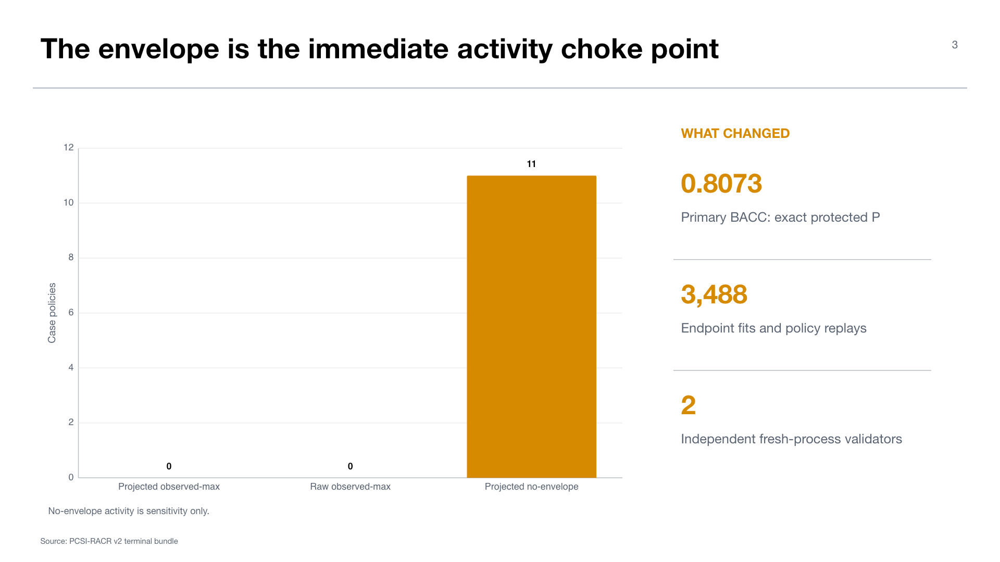

# Experiment 10 — PCSI-RACR route-scoped policy-regret diagnostic

**Experiment:** fixed-bank P-anchored route-scoped boundary-projected PCSI policy-regret router, v2  
**Stage:** 90 — post-hoc consumed-test sensitivity  
**Status:** complete; validation `PASS`; terminal descriptive only  
**Thesis objective:** architecture-level diagnosis for objective 3

## Research question

Can route-local posterior sample-influence and policy-regret transport recover useful case-level actions while preserving exact protected-P fallback and strict own-case noninterference?

This successor addresses a weakness of global calibration: action utility may transport locally in descriptor space even when a single global envelope is too conservative.

## Design and workload

The experiment reconstructs 810 physical probability cells over 9,928 rows and 218 whole-case routes from six fenced original inputs. It performs 3,488 endpoint fits, 436 target posteriors, 1,314 utility fits, and 3,488 policy replays. Two independent fresh-process validators reconstruct the bundle.

Strict `H/J` double exclusion prevents each held case from influencing its own route. Boundary projection and route-local transport produce candidate policies. The observed-donor maximum envelope is descriptive uncertainty calibration, not formal conformal coverage.

## Results

The primary `PCSI_RACR_PROJECTED_OBSERVED_MAX` policy authorizes zero target case policies and exactly preserves P at BACC `0.807317`. The raw observed-max control also authorizes zero. Proper-loss means are numerically nonincreasing, but there are no BACC routes or threshold switches.

The projected no-envelope sensitivity authorizes 11 case policies. This difference is the experiment's main mechanism result: candidate action signal exists after projection, but the observed-donor maximum envelope suppresses all target actions.

The terminal bundle reports `PASS_TERMINAL_DESCRIPTIVE_ONLY` and route-scoped own-case noninterference. Its publication state remains `POST_HOC_CONSUMED_TEST_SENSITIVITY`; no success gate is defined.

## Interpretation

PCSI-RACR narrows the choke point from “the router has no candidate signal” to “the uncertainty transport is too weak or too conservative to authorize that signal.” Removing the envelope activates cases, but that sensitivity cannot establish that the actions are safe or beneficial on fresh data.

The result also demonstrates substantial implementation progress: complex nested exclusions, sealed per-case decisions, and fresh-process reconstruction work end to end. Software correctness remains separate from scientific routing validity.

## Reproducibility caveat

The canonical v2 artifact records a dirty repository revision (`d0754475...`). The bundle validates, but the exact diff or a clean reconstruction should be archived before treating it as a long-lived software artifact.

## Claim boundary

No PCSI-RACR output may feed Stage 60/70, model selection, deployment, significance, or thesis-confirmatory evidence. The 11 no-envelope authorizations are a sensitivity analysis, not a candidate policy for promotion.

## Supervisor takeaway

The remaining barrier is credible uncertainty transport. A fresh experiment would need to freeze one envelope and validate its action utility on a new whole-case/patient/slide-disjoint surface.

## Sources

- Workstation artifact: `artifacts/midogpp/90_oracles_and_diagnostics/uniform_b_v2_consumed_test_fixed_bank_p_anchored_route_scoped_boundary_projected_pcsi_policy_regret_router/v2/`.
- `reports/diagnostic_summary.json`, `reports/phase_telemetry.json`, `tables/policy_authorizations.json`, and validation reports.

