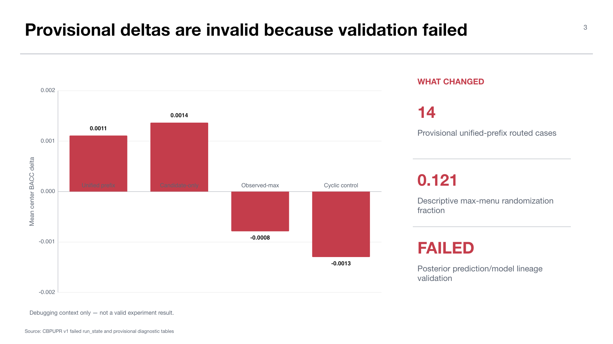

# Experiment 11 — CBPUPR center-balanced posterior-utility prefix diagnostic

**Experiment:** fixed-bank P-anchored route-scoped center-balanced posterior-utility prefix router, v1  
**Stage:** 90 — consumed-test terminal diagnostic attempt  
**Final run status:** `FAILED` during content and fresh-process validation  
**Scientific status:** no validated result; debugging evidence only

## Research question

Can center-balanced expected-utility predictions choose a small prefix of case actions that improves protected portfolio P while maintaining proper-loss safety and a selection-aware descriptive comparison?

The design aims to avoid a single global all-or-nothing route decision. It filters descriptors through crossing, positive-BACC, and proper-loss gates, then chooses a bounded prefix of case actions.

## Execution history

The first launch failed closed at workstation preflight with `Label-free workstation topology drifted.` A repaired run then passed preflight, generated all 27 source streams, completed all 81 prediction tasks, fit its route endpoints, opened terminal capabilities, and produced provisional tables and reports.

The run ultimately failed at `CONTENT_AND_TWO_FRESH_PROCESS_VALIDATION` with `CBPUPR persisted posterior prediction/model lineage drifted.` The run state has `status=FAILED`, `error_class=ProtocolError`, and disallows terminal or cross-run recovery.

## Provisional diagnostic contents — invalid for scientific use

The persisted pre-failure bundle reports P at BACC `0.807317`. The unified-prefix method routes 14 cases and has provisional BACC `0.808428`, delta `+0.001111`, with descriptive interval `[-0.000474,+0.002697]`. Candidate-only routes 81 cases and has provisional delta `+0.001367`, interval `[-0.001067,+0.003800]`.

The observed-max and cyclic controls are worse than P. The selection-aware maximum over the fixed method menu is `+0.001367`; the descriptive randomization fraction is `0.121094`. None of these quantities is valid as an experiment result because the bundle failed lineage validation.

The provisional gate funnel contains 1,308 descriptors; 349 cross, 145 remain positive-BACC, 131 are proper-safe, 81 case candidates are selected, six centers admit a feasible prefix, and 14 cases route. These counts are useful for debugging where activity enters the method.

## Interpretation

The run demonstrates that the prefix construction can produce nonzero activity, unlike the earlier zero-route envelopes. It does not demonstrate routing benefit. The final validator found that persisted posterior predictions and model lineage could not be reconstructed consistently; therefore the measured deltas cannot be trusted as canonical outputs.

This is exactly why the pipeline uses content and fresh-process validation. A small positive delta would be tempting to present, but doing so would collapse software and scientific validity into one claim.

## Required next step

Diagnose the prediction/model lineage mismatch using the failed root as immutable evidence. Do not resume or consume its scratch, predictions, tables, or checkpoints. If the experiment remains worth running, implement a bounded fix, add a focused poison/reconstruction test, synchronize a clean revision, prepare a new output identity, and rerun from the six allowed original inputs.

## Claim boundary

There is no scientific CBPUPR result. The only defensible claim is that the attempted run progressed through generation and scoring but failed the required content/fresh-process validation. Provisional numeric tables are debugging context only and may not feed any thesis conclusion, route, model, policy, stage, or later experiment.

## Supervisor takeaway

CBPUPR is evidence of methodological and validation progress, not performance progress. The thesis conclusion must continue to rely on completed Stage 70 and validated Stage-90 diagnostics.

## Sources

- Failed workstation root: `artifacts/midogpp/90_oracles_and_diagnostics/uniform_b_v2_consumed_test_fixed_bank_p_anchored_route_scoped_center_balanced_posterior_utility_prefix_router/v1/`.
- `reports/run_state.json`, `reports/diagnostic_summary.json`, `reports/publication_decision.json`, `tables/gate_funnel.json`, and `tables/terminal_method_metrics.json`.

